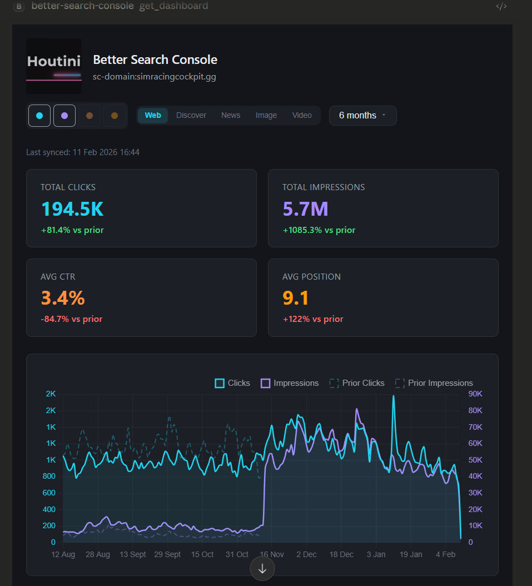

# Better Search Console

[](https://www.npmjs.com/package/@houtini/better-search-console)
[](https://snyk.io/test/github/houtini-ai/better-search-console)
[](https://opensource.org/licenses/Apache-2.0)
[](https://www.typescriptlang.org/)
[](https://modelcontextprotocol.io)



## Why This Exists

Every SEO tool that connects to an LLM has the same problem: the Google Search Console API returns 1,000 rows per request, your context window fills up fast, and you end up asking the model to reason about a tiny fraction of your data. The answers sound plausible but they're built on incomplete information.

This MCP server takes a different approach. It downloads your entire Search Console dataset into a local SQLite database, then gives Claude pre-built SQL queries for every standard SEO analysis type. Claude never sees the raw data. It sees query results: the top 50 declining pages, the queries ranking 5-20 with high impressions, the device breakdown for a specific URL pattern. Precise answers from complete data, using a few hundred tokens instead of tens of thousands.

The experiment started with ext-apps, the MCP specification's support for interactive UI components. The dashboard, overview grid, and sync progress views all render as iframes inside Claude Desktop. Whether this represents the future of MCP tooling or a novelty is still an open question. But the core architecture of local SQLite plus structured SQL queries works well regardless.

### What you get

One database per GSC property, synced in the background with full pagination (no row limits). Sixteen pre-built insight queries covering the things SEOs check repeatedly. Custom SQL for everything else. Automatic data retention that prunes low-value rows after each sync to keep databases from growing without bound. The data stays on your machine and the queries run in milliseconds.

## Quick Start

### Prerequisites

You'll need three things before this works:

1. **A Google Cloud service account** with the Search Console API enabled
2. **The service account email added as a user** on each GSC property you want to access (Settings > Users and permissions in Search Console)
3. **Node.js 18+**

If you haven't created a service account before: go to the [Google Cloud Console](https://console.cloud.google.com/), create a project, enable the "Google Search Console API", create a service account, and download the JSON key file. The whole process takes about five minutes.

### Claude Desktop Configuration

Add this to your Claude Desktop config file:

**Windows**: `%APPDATA%\Claude\claude_desktop_config.json`
**macOS**: `~/Library/Application Support/Claude/claude_desktop_config.json`

#### Using npx (recommended)

```json
{
  "mcpServers": {
    "better-search-console": {
      "command": "npx",
      "args": ["@houtini/better-search-console"],
      "env": {
        "GOOGLE_APPLICATION_CREDENTIALS": "/path/to/service-account.json"
      }
    }
  }
}
```

#### Using a local build

```json
{
  "mcpServers": {
    "better-search-console": {
      "command": "node",
      "args": ["C:\\MCP\\better-search-console\\dist\\index.js"],
      "env": {
        "GOOGLE_APPLICATION_CREDENTIALS": "C:\\path\\to\\service-account.json",
        "BSC_DATA_DIR": "C:\\seo-audits\\better-search-console"
      }
    }
  }
}
```

### Environment Variables

| Variable | Required | Default | What it does |
|----------|----------|---------|--------------|
| `GOOGLE_APPLICATION_CREDENTIALS` | Yes | - | Path to the service account JSON key file |
| `BSC_DATA_DIR` | No | `~/seo-audits/better-search-console` | Where SQLite databases are stored |

### First Run

Tell Claude: *"Show me my search console data"*

The `setup` tool handles the rest: discovers your properties, syncs them all in the background, and shows an overview grid with sparkline trends. Depending on how much data you have, initial sync takes anywhere from 30 seconds to a few minutes.

## Tools

### Setup and Sync

| Tool | What it does |
|------|-------------|
| `setup` | First-run experience. Lists properties, syncs all, returns overview |
| `sync_gsc_data` | Sync a single property. Returns a job ID for progress tracking |
| `sync_all_properties` | Sync every accessible property. Runs up to 2 in parallel |
| `check_sync_status` | Poll a sync job for progress. Omit the job ID to see all jobs |
| `cancel_sync` | Stop a running sync gracefully |

### Analysis

| Tool | What it does |
|------|-------------|
| `get_overview` | All properties at a glance with clicks, impressions, CTR, position, and sparkline trends |
| `get_dashboard` | Deep dive into one property. Hero metrics, trend chart, top queries, top pages, country breakdown, ranking distribution, new/lost queries, branded split |
| `get_insights` | Sixteen pre-built analytical queries (see below) |
| `compare_periods` | Side-by-side comparison of two arbitrary date ranges across any dimension |
| `query_gsc_data` | Run any SELECT query against the `search_analytics` table |
| `prune_database` | Apply data retention policy manually. Preview mode available |

### Insight Types

The `get_insights` tool supports these report types:

| Insight | What it shows |
|---------|--------------|
| `summary` | Aggregate metrics with period-over-period changes |
| `top_queries` | Highest-traffic queries |
| `top_pages` | Highest-traffic pages |
| `growing_queries` | Queries gaining clicks |
| `declining_queries` | Queries losing clicks |
| `growing_pages` | Pages gaining clicks |
| `declining_pages` | Pages losing clicks |
| `opportunities` | Queries ranking 5-20 with high impressions. Your quick wins |
| `device_breakdown` | Desktop vs mobile vs tablet split |
| `country_breakdown` | Traffic by country |
| `page_queries` | All queries driving traffic to a specific page |
| `query_pages` | All pages ranking for a specific query |
| `daily_trend` | Day-by-day metrics for the period |
| `new_queries` | Queries that appeared in the current period but not the previous |
| `lost_queries` | Queries that disappeared |
| `branded_split` | Branded vs non-branded traffic (pass your brand terms) |

## Data Retention

Large GSC properties generate millions of rows. A site with 50,000 pages indexed across 200+ countries accumulates data fast, and most of it is noise: zero-click impressions from countries you don't target, queries that appeared once and never again.

The retention system prunes this automatically after each sync. Recent data (last 90 days by default) is never touched. Older data is filtered by two rules:

**Target countries** (US, UK, EU, Australia, Canada): rows with zero clicks are kept only if they have 5+ impressions. This preserves queries with visibility potential whilst removing the long tail of single-impression noise.

**Non-target countries**: rows with zero clicks are deleted entirely. If nobody in Uzbekistan has ever clicked through on one of your results, that row isn't informing any decision.

Rows with clicks are never deleted regardless of age or country.

After deletion, the database is vacuumed to reclaim disk space and ANALYZE is run to update the query planner.

### Manual Pruning

You can trigger this yourself with the `prune_database` tool. Preview mode shows what would be deleted without touching anything:

```
prune_database siteUrl="sc-domain:example.com" preview=true
```

Then run for real:

```
prune_database siteUrl="sc-domain:example.com"
```

Both `recentDays` (default: 90) and `targetMinImpressions` (default: 5) are configurable per run.

### Results

On a site with 9.8 million rows and a 6GB database, the initial prune deleted 6.3 million rows (64%), reduced the database to 2.2GB, and preserved every single click. All impressions data for actionable queries remained intact. Subsequent syncs prune incrementally, so the database never bloats again.

## Custom SQL

The `query_gsc_data` tool accepts any SELECT query against the `search_analytics` table. INSERT, UPDATE, DELETE, DROP, ALTER, and CREATE are blocked.

### Schema

```sql
search_analytics (
  date       TEXT,     -- YYYY-MM-DD
  query      TEXT,
  page       TEXT,
  device     TEXT,     -- DESKTOP, MOBILE, TABLET
  country    TEXT,     -- ISO 3166-1 alpha-3 lowercase
  clicks     INTEGER,
  impressions INTEGER,
  ctr        REAL,
  position   REAL
)
```

### Example Queries

Find cannibalisation (multiple pages ranking for the same query):

```sql
SELECT query, COUNT(DISTINCT page) as pages, SUM(clicks) as clicks
FROM search_analytics
WHERE date >= '2025-01-01'
GROUP BY query
HAVING pages > 1
ORDER BY clicks DESC
LIMIT 20
```

Content decay detection:

```sql
SELECT page, 
  SUM(CASE WHEN date >= date('now', '-28 days') THEN clicks END) as recent,
  SUM(CASE WHEN date BETWEEN date('now', '-56 days') AND date('now', '-29 days') THEN clicks END) as prior
FROM search_analytics
GROUP BY page
HAVING prior > 10
ORDER BY (recent * 1.0 / NULLIF(prior, 0)) ASC
LIMIT 20
```

Mobile vs desktop performance gap:

```sql
SELECT page, device,
  SUM(clicks) as clicks,
  AVG(position) as avg_position
FROM search_analytics
WHERE date >= date('now', '-28 days')
GROUP BY page, device
HAVING clicks > 5
ORDER BY page, device
```

## Architecture

### How Sync Works

The GSC API paginates at 25,000 rows per request. For large properties with millions of rows across 16 months of data, that means hundreds of API calls. The sync system handles this:

1. Date ranges are chunked into 30-day windows
2. Chunks run in parallel (concurrency of 3 by default)
3. Each chunk paginates until the API returns fewer than 25,000 rows
4. Rows are batch-inserted into SQLite with UPSERT semantics
5. After all chunks complete, the data retention policy runs automatically

Sync jobs run in the background. The `setup` tool blocks until completion for the first-run experience, but `sync_gsc_data` and `sync_all_properties` return immediately with a job ID.

### ext-apps UI

Three interactive views are built with Vite and `vite-plugin-singlefile`, producing self-contained HTML files served as MCP resources:

- **Dashboard**: trend chart (Chart.js), hero metrics, top queries/pages tables, ranking distribution, country breakdown, new/lost queries, branded split
- **Overview**: grid of property cards with sparklines and period-over-period changes
- **Sync progress**: real-time progress bar with row counts and ETA

Client-side code uses `@modelcontextprotocol/ext-apps` for bidirectional communication with the server. Data flows as `structuredContent` alongside the text response.

### Project Structure

```
src/
  core/
    Database.ts         SQLite wrapper with schema, UPSERT, sync logging
    DataRetention.ts    Prune/preview logic with configurable retention policy
    GscClient.ts        Google Search Console API client with pagination
    SyncManager.ts      Background sync orchestration with job tracking
  tools/
    compare-periods.ts  Period comparison across dimensions
    get-dashboard.ts    Dashboard data assembly
    get-insights.ts     16 pre-built analytical queries
    get-overview.ts     Multi-property overview with sparklines
    helpers.ts          Date ranges, DB paths, formatting
    list-properties.ts  Property discovery with sync status
    query-data.ts       Custom SQL execution with safety checks
  types/
    index.ts            Shared TypeScript interfaces
  ui/
    dashboard.html/ts   Dashboard ext-apps UI
    overview.html/ts    Overview grid ext-apps UI
    sync-progress.html/ts  Sync progress ext-apps UI
  index.ts              Entry point
  server.ts             MCP server, tool registration, resource serving
```

## Development

### Building from Source

```bash
git clone https://github.com/houtini-ai/better-search-console.git
cd better-search-console
npm install
npm run build
```

### Scripts

| Command | What it does |
|---------|-------------|
| `npm run build` | Build everything (server TypeScript + UI bundles) |
| `npm run build:server` | TypeScript compilation only |
| `npm run build:ui` | Vite builds for all three UI views |
| `npm run dev` | Watch mode for server TypeScript |
| `npm start` | Run the compiled server |

### Adding Insight Queries

New insights go in `src/tools/get-insights.ts`. Each insight is a function that takes the standard params (siteUrl, dateRange, filters) and returns a SQL result. The pattern is consistent: calculate date ranges, build parameterised SQL, execute against the property database, return structured results.

## Troubleshooting

### "No Google Search Console properties found"

The service account needs to be added as a user on each property. Go to Search Console > Settings > Users and permissions > Add user. Use the service account email from your JSON key file (it looks like `name@project.iam.gserviceaccount.com`). Grant "Full" permission level.

### Sync takes a long time

Large properties with years of data and many countries can have millions of rows. Initial sync for a property with 10 million rows takes 5-10 minutes. Subsequent syncs are incremental (only fetching new dates) and complete in seconds.

### Database files are large

Run `prune_database` with `preview=true` to see how much can be cleaned up. The default retention policy typically removes 50-70% of rows from properties with international traffic. The auto-prune after each sync prevents future bloat.

### ext-apps UI not rendering

The interactive dashboards require Claude Desktop with ext-apps support. If you're using an older version or a different MCP client, the text-based fallback responses still contain all the data.

## Licence

Apache-2.0. See [LICENSE](LICENSE) for details.

## Disclaimer

This software is provided as-is. Your GSC data is stored locally in SQLite databases on your machine. The server communicates with Google's Search Console API using your service account credentials. Review Google's API terms of service and ensure your usage complies.

API keys and service account credentials are sensitive. Keep them out of version control, rotate them if exposed, and restrict service account permissions to the Search Console API only.

---

Built by [Houtini](https://houtini.ai) for the Model Context Protocol community.
