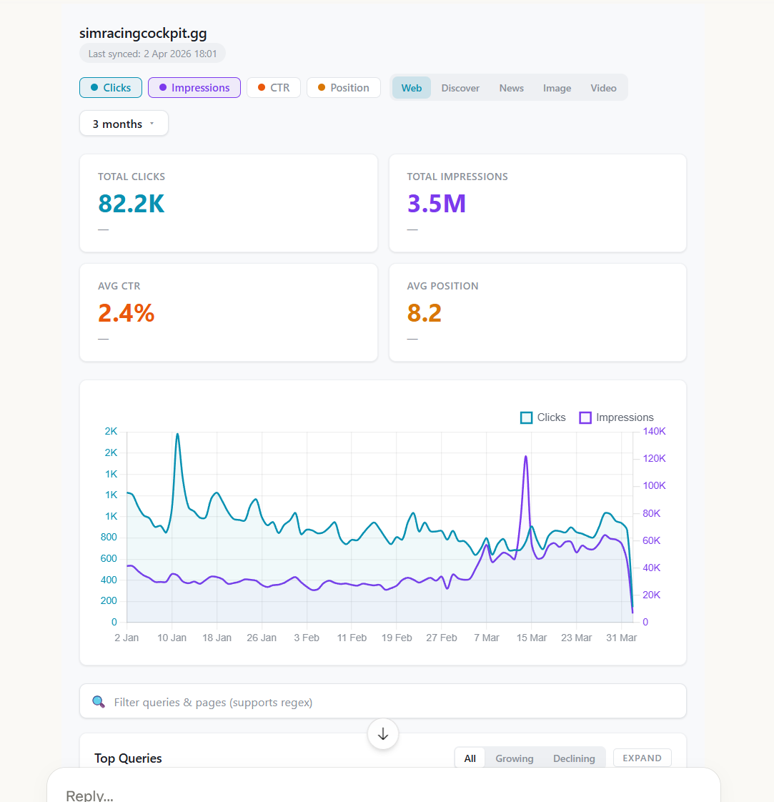
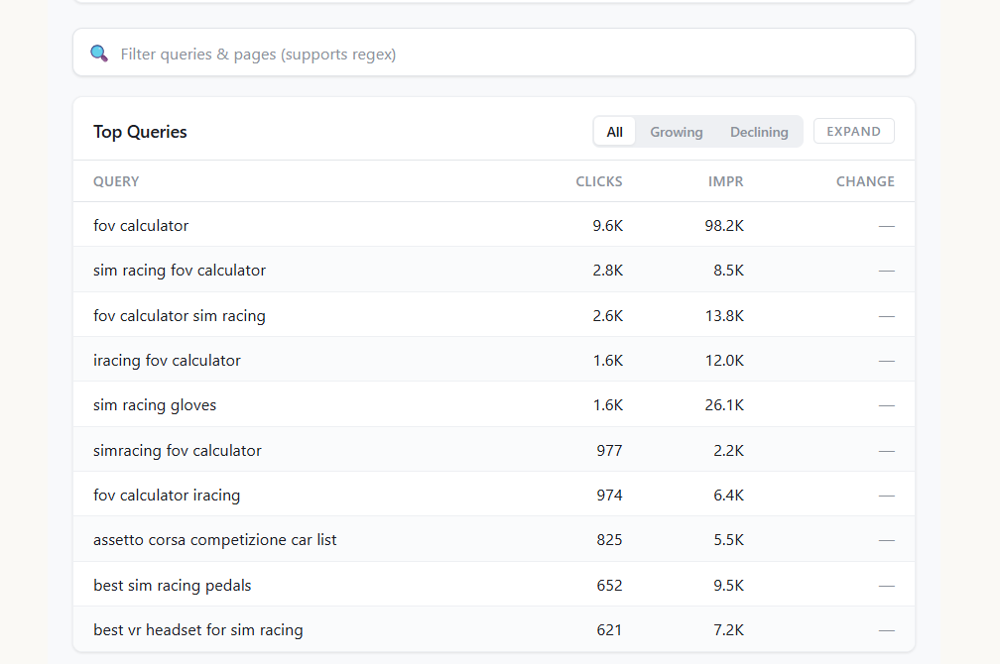
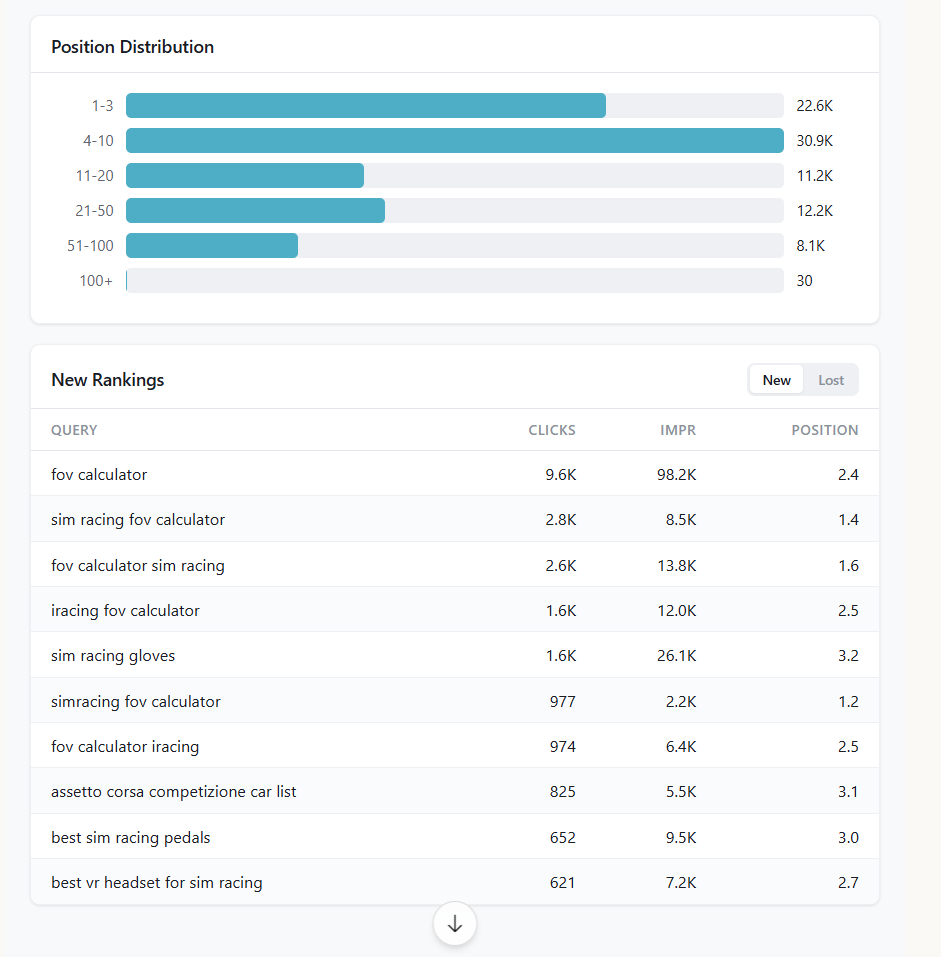
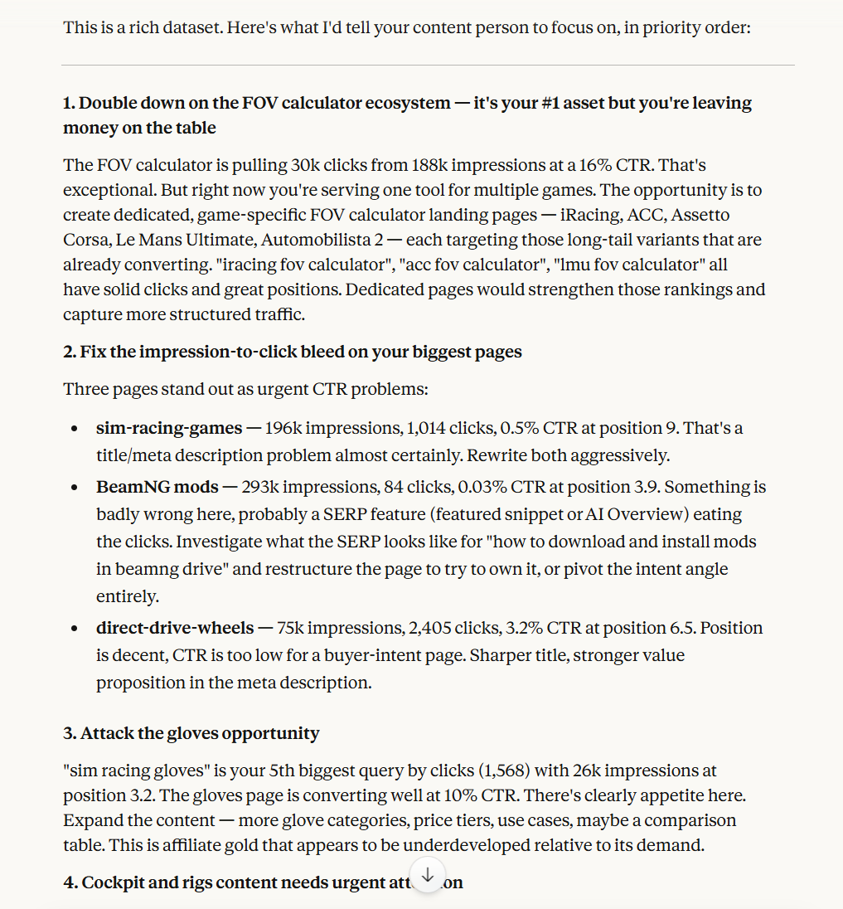

# Get SEO data from Google Search Console with the Better Search Console MCP

[](https://www.npmjs.com/package/@houtini/better-search-console)
[](https://snyk.io/test/github/houtini-ai/better-search-console)
[](https://registry.modelcontextprotocol.io)
[](https://opensource.org/licenses/Apache-2.0)
[](https://www.typescriptlang.org/)

**Run a full SEO audit on your site using Claude and your real Google Search Console data.**

Connect this MCP server, get your GSC seo data, and ask Claude to find your content decay, cannibalisation, striking distance keywords, CTR problems, and growth opportunities. Claude analyses your *complete* dataset &mdash; not the 1,000-row sample the API normally returns &mdash; and gives you prioritised, actionable recommendations. Just like a good seo consultant. 



<p align="center">
  <a href="https://glama.ai/mcp/servers/@houtini-ai/better-search-console">
    
  </a>
</p>

> **Navigation**
>
> [How to audit your site](#how-to-audit-your-site-with-claude) | [Quick start](#quick-start) | [vs SEOgets](#better-search-console-vs-seogets) | [Tools](#tools) | [Custom SQL](#custom-sql) | [Data retention](#data-retention) | [Development](#development)

## How to Audit Your Site with Claude

Once you've installed the server ([quick start below](#quick-start)), here's how to run a proper SEO audit using conversation with Claude. Each prompt targets a specific audit area, and Claude will query your full dataset to answer.

### 1. Get the lay of the land

Start broad. Ask Claude to show you the dashboard, then follow up:

> *"Show me my search console data for the last 3 months"*
>
> *"What's my overall trajectory? Are clicks and impressions trending up or down?"*

### 2. Find your quick wins (striking distance keywords)

These are queries where you're ranking 5-20 with decent impressions &mdash; close to page one but not there yet. Small improvements here deliver outsized returns.

> *"Find queries where I'm ranking between position 5 and 20 with more than 500 impressions. Which pages are these on and what would it take to push them to page one?"*

### 3. Diagnose content decay

Pages that were performing well but are now losing traffic. Catch these early before they fall further.

> *"Which pages have lost the most clicks compared to the previous period? Focus on pages that had at least 50 clicks before."*
>
> *"For my top 5 declining pages, what queries are they losing rankings on?"*

### 4. Fix CTR problems

High impressions with low CTR means your title tags and meta descriptions aren't compelling enough, or there's a SERP feature stealing the click.

> *"Show me pages with more than 10,000 impressions but CTR below 2%. What's the average position for each?"*
>
> *"For these low-CTR pages, suggest better title tags based on the queries driving impressions."*

### 5. Find cannibalisation

Multiple pages competing for the same query splits your ranking signal.

> *"Find queries where more than one page is ranking. Sort by total clicks so I can see which cannibalisation is actually costing me traffic."*

### 6. Spot new opportunities

Queries that just appeared in your data &mdash; you're starting to rank for something new.

> *"What new queries appeared this month that I wasn't ranking for last month? Which ones have the most impressions?"*

### 7. Analyse by device and country

> *"Compare my mobile vs desktop CTR for my top 20 pages. Are there pages where mobile is significantly worse?"*
>
> *"Which countries am I getting impressions from but almost no clicks? Is there a localisation opportunity?"*

### 8. Get the full audit summary

> *"Based on everything you can see in my search console data, give me a prioritised list of the top 5 things I should work on this month to grow organic traffic."*





Claude analyses the full dataset and returns prioritised, specific recommendations:



## Better Search Console vs SEOgets

This project was inspired by [SEOgets](https://seogets.com?ref=src), which is an excellent GSC analytics platform. If you want a polished, hosted UI with content grouping and topic clustering, [check them out](https://seogets.com?ref=src) &mdash; they're worth the $49/month for teams that need a production dashboard.

That said, this MCP server exists because we wanted something different: an AI-native workflow where Claude directly queries your data and gives you recommendations, not just charts.

Here's an honest comparison:

| Feature | Better Search Console | [SEOgets](https://seogets.com?ref=src) |
|---------|----------------------|----------|
| **Price** | Free, open source | $49/month |
| **Row limit** | None (full pagination) | 50,000 rows |
| **Data storage** | Local SQLite, unlimited retention | Cloud-hosted |
| **AI analysis** | Claude queries your data directly, gives recommendations | No LLM integration |
| **Custom SQL** | Full SQL access to raw data | No |
| **Content grouping** | No (ask Claude to group by pattern) | Yes, one-click |
| **Topic clustering** | No (ask Claude to cluster) | Yes, one-click |
| **Cannibalisation report** | Yes (via SQL or ask Claude) | Yes, built-in |
| **Striking distance** | Yes (built-in insight) | Yes, built-in |
| **Content decay** | Yes (via SQL or ask Claude) | Yes, heatmap |
| **Index monitoring** | No | Yes, up to 5,000 pages |
| **Shareable reports** | No | Yes, client portal |
| **SEO testing** | No | Yes, built-in |
| **Multi-user** | No | Yes, unlimited users |
| **Hosting** | Self-hosted (your machine) | Fully hosted |

**Where [SEOgets](https://seogets.com?ref=src) wins:** Content grouping, topic clustering, index monitoring, shareable client portals, SEO testing, and a polished hosted UI that doesn't require any setup beyond OAuth. If you're an agency sending reports to clients, [SEOgets](https://seogets.com?ref=src) is the better choice.

**Where Better Search Console wins:** No row limits (we sync everything, not 50K rows), direct AI analysis with actionable recommendations, full SQL access to raw data, completely free, and your data never leaves your machine. If you want Claude to audit your site and tell you what to fix, this is what it's built for.

They solve different problems. Use both if you want.

## Quick Start

### Step 1: Set Up Google Credentials

You need a Google Cloud service account with Search Console API access.

#### Create a Google Cloud project and enable the API

1. Go to the [Google Cloud Console](https://console.cloud.google.com/)
2. Create a new project (or select an existing one)
3. Go to **APIs and Services > Library**
4. Search for **Google Search Console API** and click **Enable**

#### Create a service account

1. Go to **APIs and Services > Credentials**
2. Click **Create Credentials > Service account**
3. Give it a name (e.g. `search-console-mcp`) and click **Create and Continue**
4. Skip the optional role and user access steps, click **Done**
5. Click on the service account you just created
6. Go to the **Keys** tab
7. Click **Add Key > Create new key > JSON**
8. Save the downloaded JSON file somewhere safe (e.g. `~/credentials/gsc-service-account.json`)

For full details, see the [Google Workspace credentials guide](https://developers.google.com/workspace/guides/create-credentials).

#### Grant the service account access to Search Console

1. Open the JSON key file and copy the `client_email` value
2. Go to [Google Search Console](https://search.google.com/search-console/)
3. Select a property
4. Go to **Settings > Users and permissions > Add user**
5. Paste the service account email and set permission to **Full**
6. Repeat for each property you want to access

### Step 2: Add to Claude Desktop

Add this to your Claude Desktop config file:

- **Windows**: `%APPDATA%\Claude\claude_desktop_config.json`
- **macOS**: `~/Library/Application Support/Claude/claude_desktop_config.json`

```json
{
  "mcpServers": {
    "better-search-console": {
      "command": "npx",
      "args": ["-y", "@houtini/better-search-console"],
      "env": {
        "GOOGLE_APPLICATION_CREDENTIALS": "/path/to/your-service-account.json"
      }
    }
  }
}
```

### Claude Code (CLI)

```bash
claude mcp add \
  -e GOOGLE_APPLICATION_CREDENTIALS=/path/to/your-service-account.json \
  -s user \
  better-search-console -- npx -y @houtini/better-search-console
```

Verify with `claude mcp get better-search-console` &mdash; you should see `Status: Connected`.

### Step 3: Start your audit

Tell Claude: *"Show me my search console data"*

The `setup` tool discovers your properties, syncs them in the background, and shows an overview. Initial sync takes 30 seconds to a few minutes depending on data volume. Then follow the [audit guide above](#how-to-audit-your-site-with-claude).

### Environment Variables

| Variable | Required | Default | Description |
|----------|----------|---------|-------------|
| `GOOGLE_APPLICATION_CREDENTIALS` | Yes | &mdash; | Path to the service account JSON key file |
| `BSC_DATA_DIR` | No | `~/seo-audits/better-search-console` | Where SQLite databases are stored |

## Tools

### Setup and Sync

| Tool | Description |
|------|-------------|
| `setup` | First-run experience. Lists properties, syncs all, returns overview |
| `sync_gsc_data` | Sync a single property. Full pagination, no row limits |
| `sync_all_properties` | Sync every accessible property (up to 2 in parallel) |
| `check_sync_status` | Poll sync progress. Omit job ID to see all jobs |
| `cancel_sync` | Stop a running sync |

### Analysis

| Tool | Description |
|------|-------------|
| `get_overview` | All properties at a glance with sparkline trends |
| `get_dashboard` | Deep dive: metrics, trend chart, top queries/pages, countries, ranking distribution, new/lost queries, branded split |
| `get_insights` | 16 pre-built analytical queries (see below) |
| `compare_periods` | Compare two date ranges across any dimension |
| `query_gsc_data` | Run any SELECT query against the raw data |
| `prune_database` | Apply data retention policy (preview mode available) |

### Insight Types

| Insight | Description |
|---------|-------------|
| `summary` | Aggregate metrics with period-over-period changes |
| `top_queries` | Highest-traffic queries |
| `top_pages` | Highest-traffic pages |
| `growing_queries` / `declining_queries` | Queries gaining or losing clicks |
| `growing_pages` / `declining_pages` | Pages gaining or losing clicks |
| `opportunities` | Queries ranking 5-20 with high impressions &mdash; your quick wins |
| `device_breakdown` | Desktop vs mobile vs tablet |
| `country_breakdown` | Traffic by country |
| `page_queries` / `query_pages` | Queries for a page, or pages for a query |
| `daily_trend` | Day-by-day metrics |
| `new_queries` / `lost_queries` | Queries that appeared or disappeared |
| `branded_split` | Branded vs non-branded traffic |

## Dashboard Rendering

The interactive dashboards are built with **Chart.js** and **Vite**, bundled into self-contained HTML files using `vite-plugin-singlefile`, and served via the MCP **ext-apps** protocol as embedded iframes in Claude Desktop.

Features include metric toggles (clicks, impressions, CTR, position), period comparison with dashed overlays, regex query/page filtering, date range presets, and automatic light/dark theme. Site logos load dynamically via logo.dev.

If your MCP client doesn't support ext-apps, all tools return structured data that Claude can analyse in text.

## Custom SQL

The `query_gsc_data` tool accepts any SELECT against the `search_analytics` table:

```sql
search_analytics (
  date       TEXT,     -- YYYY-MM-DD
  query      TEXT,
  page       TEXT,
  device     TEXT,     -- DESKTOP, MOBILE, TABLET
  country    TEXT,     -- ISO 3166-1 alpha-3 lowercase
  clicks     INTEGER,
  impressions INTEGER,
  ctr        REAL,
  position   REAL
)
```

**Find cannibalisation:**

```sql
SELECT query, COUNT(DISTINCT page) as pages, SUM(clicks) as clicks
FROM search_analytics
WHERE date >= '2025-01-01'
GROUP BY query HAVING pages > 1
ORDER BY clicks DESC LIMIT 20
```

**Content decay detection:**

```sql
SELECT page,
  SUM(CASE WHEN date >= date('now', '-28 days') THEN clicks END) as recent,
  SUM(CASE WHEN date BETWEEN date('now', '-56 days') AND date('now', '-29 days') THEN clicks END) as prior
FROM search_analytics
GROUP BY page HAVING prior > 10
ORDER BY (recent * 1.0 / NULLIF(prior, 0)) ASC LIMIT 20
```

## Data Retention

Large properties generate millions of rows. The retention system prunes automatically after each sync:

- **Recent data** (last 90 days) is never touched
- **Target countries** (US, UK, EU, AU, CA): zero-click rows kept only if 5+ impressions
- **Non-target countries**: zero-click rows deleted entirely
- **Rows with clicks are never deleted**

On a 9.8M row database, initial prune removed 6.3M rows (64%), reduced size from 6GB to 2.2GB, and preserved every click.

Run manually with `prune_database` (use `preview=true` to see what would be deleted first).

## Development

```bash
git clone https://github.com/houtini-ai/better-search-console.git
cd better-search-console
npm install
npm run build
```

| Command | Description |
|---------|-------------|
| `npm run build` | Build everything (server + UI bundles) |
| `npm run build:server` | TypeScript compilation only |
| `npm run build:ui` | Vite builds for all three UI views |
| `npm run dev` | Watch mode for server TypeScript |
| `npm start` | Run the compiled server |

## Troubleshooting

**"No Google Search Console properties found"** &mdash; The service account needs to be added as a user on each property in Search Console > Settings > Users and permissions.

**Sync takes a long time** &mdash; Large properties with years of data can have millions of rows. Initial sync for 10M rows takes 5-10 minutes. Subsequent syncs are incremental.

**ext-apps UI not rendering** &mdash; The dashboards require Claude Desktop with ext-apps support. Text-based fallback responses still contain all the data.

## Licence

Apache-2.0. See [LICENSE](LICENSE) for details.

---

Built by [Houtini](https://houtini.ai) for the Model Context Protocol community. Inspired by the excellent [SEOgets](https://seogets.com?ref=src).
